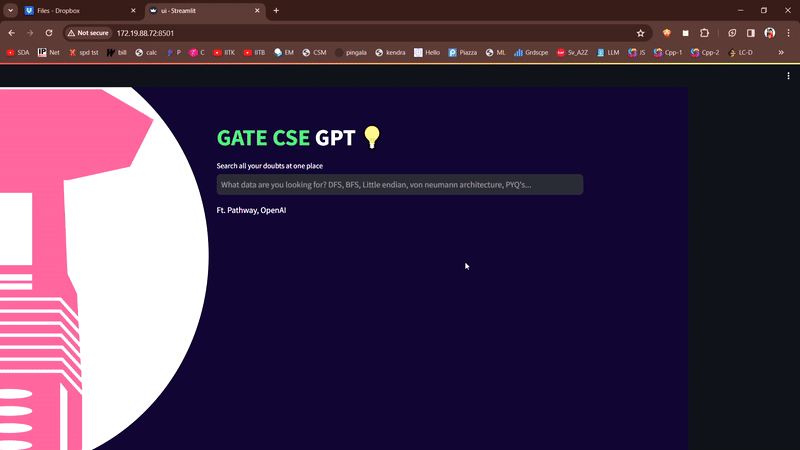
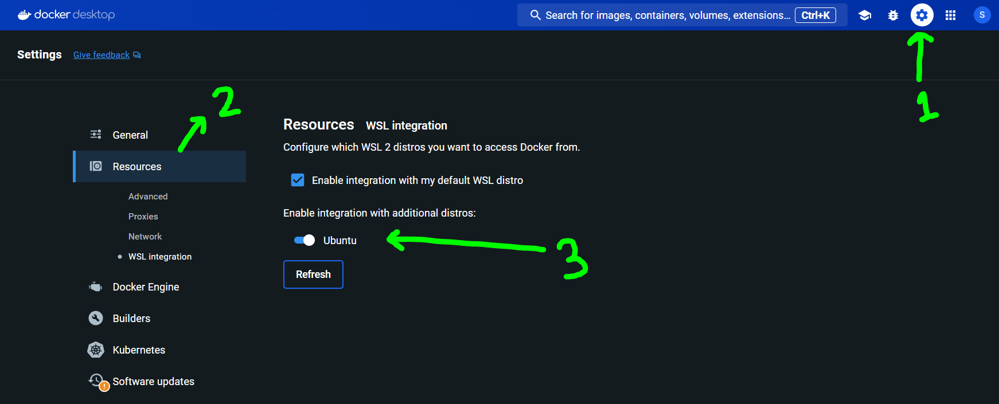

# GATE CSE GPT, The problem and solution

* This repo will be used and managed by contributers only.
* Users can directly use the website after it is hosted.

A chatbot-GPT powered by [OpenAI](https://openai.com/) & [Pathway](https://pathway.com/).

Aims in helping students with interview and other common doubts, related to GATE CSE exam, specifically who are facing difficulty in affording coachings.
With the help of [Pathway's LLM App](https://github.com/pathwaycom/llm-app). and a [Dropbox](https://dropbox.com/) at backend, aims to help students to ace the GATE exam with free resources, helping in Post-GATE interviews and the main exam, test series equally.

The main idea is to have a shared dropbox account, with write acess to a handful of students across all IIT's, to share relavent insights about campus life, placements and interview experiences.
All of the resources will be stored in the drop-box and using these, the GPT will generate a real-time and relevent guide. 
Widely used GPT's like ChatGPT, ‎Gemini cannot produce real-time and student curated answers like this bot-GPT will produce.


This repo is mostly a modification of [Dropbox-ai-chat](https://github.com/pathway-labs/dropbox-ai-chat/tree/main)

# CAUTION
This project is under development. I am commiting for a bootcamp evaluation, will need to modify a lot before it's ready to use.

It's not recommended to use this as of now. This is using a GPT-2 as of now and is full of hallucinations.

As of now the dropbox is only having standard textbooks, needed for the GATE exam.

I am not sharing the books here, as there might be copyright problems.

` I'm sharing a pdf having some basic info's regarding master's in CSE at IIT's and some interview experiences ` just in cse someone wants to try out the potential of the project. `It is in the demo_dropbox folder`

We'll also have standard books along with interview experiences and campus information at our backend, once we have enough money to use GPT-4 and a machine to host our website 24x7.

## Demo

See how the tool will look once ready:


This shall also be very helpful for students, who are planning to switch from btech in non-CSE to mtech in CSE, as there are many students who are taking this path and there is very less helpful resource online to guide them properly.



## Steps to Follow


### Step 0: If you are a Windows user, i.e. not a MAC/Linux/Debian user.
* Download [WSL-2](https://learn.microsoft.com/en-us/windows/wsl/install) ::<< Will allow Linux shell to run on windows.
* Refer this [video](https://www.youtube.com/watch?v=Tlx7qZCPIsA&ab_channel=CloudChamp) for a better clarity. ` ⚠ Recommended ⚠ `
* Since you're inside a new Linux environment, you'll need to install many stuffs, like pip and all, you can figure them out buy running the main file ` python3 main.py ` and enquiring all the errors you face to chat-GPT. `Be ready for this, will be useful in Step 3`
* You'll need to change this settings inside Docker to allow docker in ubuntu `Be ready for this, will be useful in Step 3`


  

### Step 1: Pre-requisites 
`Windows user switch to the WSL-2 folder for all further work`

* You need to have python 3.10 or more. You may download it from here: [Python](https://www.python.org/downloads/)
* Download and Install [Pip](https://pip.pypa.io/en/stable/installation/)
* Make an OpenAI account, go and get your free API token worth 5 Dollars from [here](https://platform.openai.com/api-keys) `https://platform.openai.com/api-keys`
* Check if you have enough balence, as in many cases, the balence is zero from the start. [This page of your OpenAI](https://platform.openai.com/usage) should look like this:


    

### Step 2: Clone this repo, ideally close to home directory

Done with the `git clone` command followed by the URL of the repo:

```bash
git clone https://github.com/souvikcseiitk/gate_cse_gpt
```
* Place it close to home directory as you'll need to `cd` to this directory many times.

Next,  navigate to the project folder:

```bash
cd gate_cse_gpt
```

