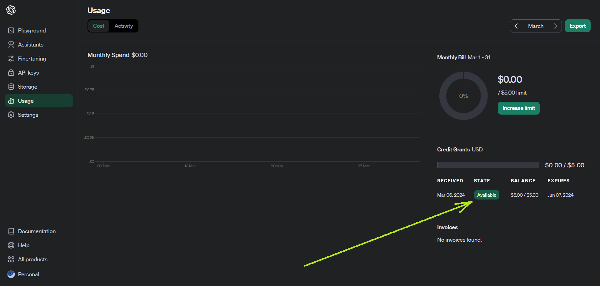

# GATE CSE GPT, The problem and solution

* This repo will be used and managed by contributers only.
* Users can directly use the website after it is hosted.

A chatbot-GPT powered by [OpenAI](https://openai.com/) & [Pathway](https://pathway.com/).

Aims in helping students with interview and other common doubts, related to GATE CSE exam, specifically who are facing difficulty in affording coachings.
With the help of [Pathway's LLM App](https://github.com/pathwaycom/llm-app), and a [Dropbox](https://dropbox.com/) at backend, aims to help students to ace the GATE exam with free resources, helping in Post-GATE interviews, the main exam, and the test series equally.

The main idea is to have a shared dropbox account, with write acess to a handful of students across all IIT's/IISc, to share relavent insights about campus life, placements and interview experiences.
All of the resources will be stored in the drop-box and using these, the GPT will generate a real-time and relevent guide. 

Widely used GPT's like ChatGPT, ‎Gemini cannot produce real-time and student curated answers like this bot-GPT will produce.


This repo is mostly a modification of [Dropbox-ai-chat](https://github.com/pathway-labs/dropbox-ai-chat/tree/main)

# ⚠ CAUTION ⚠
This project is under development. I am commiting it on github, for the pathway-iitk-iitbhu bootcamp evaluation, the genesis of the project. 
The project needs lots of modification before it's ready to use.

It's not recommended to use this as of now. This is using a GPT-2 as of now and is full of hallucinations.

As of now the dropbox is only having standard textbooks, needed for the GATE exam.

I am not sharing the books here, as there might be copyright problems.

` However I'm sharing a pdf having some basic info's regarding master's in CSE at IIT's and some interview experiences ` just in cse someone wants to try out the potential of the project. `It is in the demo_dropbox folder`

### Comming Up...
We'll have standard books along with interview experiences and campus information (placements, campus life, etc) at our backend, once we have enough money to use GPT-4 and a machine to host our website 24x7.


## Demo

See how the tool will look once ready:


This shall also be very helpful for students, who are planning to switch from btech in non-CSE to mtech in CSE, as there are many students who are taking this path and there is very less helpful resource online to guide them properly.


## Steps to Follow


### Step 0: If you are a Windows user, i.e. not a MAC/Linux/Debian user.
* Download [WSL-2](https://learn.microsoft.com/en-us/windows/wsl/install) ::<< Will allow Linux shell to run on windows.
* Refer this [video](https://www.youtube.com/watch?v=Tlx7qZCPIsA&ab_channel=CloudChamp) for a better clarity. ` ⚠ Recommended ⚠ `
* Since you're inside a new Linux environment, you'll need to install many stuffs, like pip and all, you can figure them out buy running the main file ` python3 main.py ` and enquiring all the errors you face to chat-GPT. `Be ready for this, will be useful in Step 7`
* You'll need to change this settings inside Docker to allow docker in ubuntu `Be ready for this, will be useful in Step 3`


* Once you're using Docker, you'll see `VMMem` draining a lot of your battery.
* VMMem.exe is a host process that hosts Docker containers and other virtual machines on the system.
* Docker do not get terminated once you click the close button. Switch it off from the app tray in the bottom right of the taskbar. Looks like this ( ^ ). `Right click on the docker icon and click Quit Docker Desktop` 

  

### Step 1: Pre-requisites 
`Windows users switch to the WSL-2 folder for all further work; You'll find a linux folder which looks like this, go to home -> username and start working here, the bash can be acessed by searching ubuntu in the search bar`


* You need to have python 3.10 or more. You may download it from here: [Python](https://www.python.org/downloads/)
* Download and Install [Pip](https://pip.pypa.io/en/stable/installation/)
* Make an OpenAI account, go and get your free API token worth 5 Dollars from [here](https://platform.openai.com/api-keys) `https://platform.openai.com/api-keys`
* Check if you have enough balance, as in many cases, the balance is zero from the start itself. [This page of your OpenAI](https://platform.openai.com/usage) should look like this:

    

If it's showing `exhausted`, try using a fresh mobile number to login.

### Step 2: Clone this repo, ideally close to home directory

Done with the `git clone` command followed by the URL of the repo:

```bash
git clone https://github.com/souvikcseiitk/gate_cse_gpt
```
* Place it close to home directory as you'll need to `cd` to this directory many times.

Next,  navigate to the project folder:

```bash
cd gate_cse_gpt
```

#### Step 3: Dropbox and Docker

Install [Dropbox Desktop](https://www.dropbox.com/downloading?os=win&ref=edshelf)
Install [Docker](https://docs.docker.com/engine/install/)

#### Step 4: Export Dropbox content to the gate_cse_gpt folder

`Windows` users needs to run this step outside the Linux/WSL-2 environment, i.e in the ` windows shell `
As, we need a common root for Dropbox ( ` C:\Users\souvi\Dropbox `) and our project folder, which is present inside the linux/WSL-2 environment ( ` \\wsl.localhost\Ubuntu\home\souvik\souvikcseiitk\dropbox ` )

* Run this command to install the Dropbox Python SDK:
`pip install dropbox`

* Open Dropbox for windows, you may not see the UI on the screen, it mostly runs in the background, however you can access the content from here ` C:\Users\souvi\Dropbox `

* Go to [this site](https://developers.dropbox.com/oauth-guide) to get your Dropbox access token

Update this line in the ` dropbox.py `

```bash
# Define your access token
ACCESS_TOKEN = 'YOUR_ACCESS_TOKEN'
```
  
* Update these two lines in the `dropbox.py `

```bash
# Specify the Dropbox path and local folder path
dropbox_path = 'C:\Users\souvi\Dropbox'
local_path = '\\wsl.localhost\Ubuntu\home\souvik\souvikcseiitk\dropbox'
```

* Run the `dropbox.py`

#### Step 5: Set environment variables

Modiy the `.env` file in the root directory of the project. 

* Replace the "OPENAI_API_TOKEN" value, place your OpenAI API key inside a quotation.

* Replace the dropbox address, use relative address of your dropbox.

```bash
OPENAI_API_TOKEN= "Your_OPENAI_API_KEY"
HOST=0.0.0.0
PORT=8080
EMBEDDER_LOCATOR=text-embedding-ada-002
EMBEDDING_DIMENSION=1536
MODEL_LOCATOR=gpt-3.5-turbo
MAX_TOKENS=200
TEMPERATURE=0.0
DROPBOX_LOCAL_FOLDER_PATH="../Dropbox"
```

We'll have a shared dropbox account, so that all of us can contribute (only students of IIT's/IISc who are willing to contribute) 

#### Step 6: Install the app dependencies

Install the required packages:

```bash
pip install --upgrade -r requirements.txt  #one time task; will take time ( ~ 45 mins using iitk-sec(Highspeed-5GHz) )
```

#### Step 7: Build up the Docker containers

```bash
docker-compose build #one time task; will take time ( ~ 45 mins using iitk-sec(Highspeed-5GHz) )
docker-compose up
```

Once your work is done, stop the containers using `docker-compose down` 
Windows users, Docker do not get terminated once you click the close button. Switch it off from the app tray in the bottom right of the taskbar. Looks like this ( ^ ). `Right click on the docker icon and click Quit Docker Desktop` 

#### Behind the Scenes with Docker: 
[Copied from [here](https://iitk-bhu-llm.gitbook.io/coursework/hands-on-development/dropbox-retrieval-app/building-the-dockerized-app)]

##### Dockerfile: 

This file contains a set of instructions that Docker follows to build an image. It's like a blueprint for your application. Docker reads these instructions and creates a Docker image based on them. This image contains everything your app needs to run.

##### docker-compose: 

It's a tool for defining and running multi-container Docker applications. In our context, docker-compose uses the docker-compose.yml file to understand how to set up and run the app's services. 

`When you run docker-compose up, it starts the services as defined.`

&nbsp;
#### Step 8: Run the Pathway API

You start the application by running `main.py`:

```bash
python3 main.py
```

&nbsp;
#### Step 9: Run Streamlit UI

You can run the UI separately by running Streamlit app
`streamlit run ui.py` command. It connects to the Pathway's backend API automatically and you will see the UI frontend is running on your browser.


&nbsp;
# Some common problems and solutions

&nbsp;
#### Error 1: This is not the real Pathway package


This means you are not in a MAC/Linux/Debian/WSL kind of environment. Follow Step-0 and install WSL, go to the Linux folder and work from there.

&nbsp;
#### Error 2: Token Limit error `HTTP/1.1 429 Too Many Requests`


This means, you have exhausted your OpenAI token limits, [check here] (https://platform.openai.com/usage) 


If [this](https://platform.openai.com/usage) shows `expired` instead of `available` Login with a fresh mobile number, that you have never used with open-AI.

&nbsp;
#### Error 3: error while attempting to bind on address ('0.0.0.0', 8080): address already in use 
 > >  `Change to some other port in the .env file, like try 8081 instaed of 8080`

&nbsp;
#### Error 4: Any problem related to some package not found that you have already installed. Like `dotenv`, `litellm`, `streamlit`, `pip`, etc not found.

Find where that package is located by either ChatGPT or come out to root and do manual search in the search box. 
Most of the things are here (\\wsl.localhost\Ubuntu\home\souvik\.local\lib\python3.10\site-packages)

Let the package not found is `y`

Let `x` = \\wsl.localhost\Ubuntu\home\souvik\.local\lib\python3.10\site-packages\ `y`
Bring this `y` to your working folder.

For example 
Bring the `y` folder from ( `x` ) to (\\wsl.localhost\Ubuntu\home\souvik\gate_cse_gpt) where we have main.py

&nbsp;
&nbsp;
# Some screenshots of the working environment

&nbsp;
&nbsp;
#### The UI ↓ 
&nbsp;


&nbsp;
&nbsp;
#### Hallucinations of GPT-2 😂 ↓ 
&nbsp;


&nbsp;
&nbsp;
#### The main.py application and ui.py hosted ↓ 
&nbsp;


&nbsp;
&nbsp;
#### The main.py application and ui.py hosted along with docker ↓ 
&nbsp;


&nbsp;
&nbsp;
#### Our drop-box as of now, with standard textbooks, needed for GATE CSE ↓ 
&nbsp;

